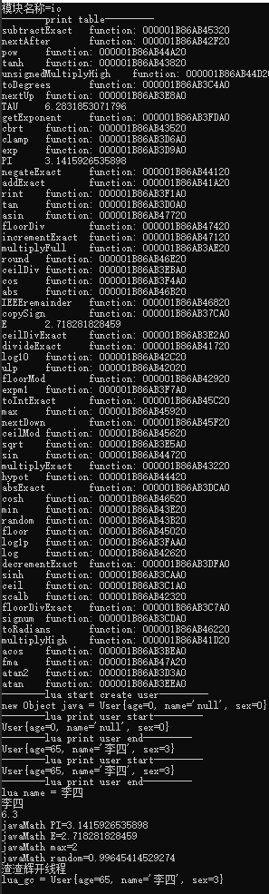

# java22ffm java高度集成lua

## 编写测试代码

[TestLua3](../src/main/com/git/test/TestLua3.java)


## 核心代码详解

```java
        // 打开内置库
        luaL_openlibs(lua_State);
        var luaUtil = new LuaUtil();
        // 加载自定义的javaMath库
        LuaMathUtil.openJavaMath(lua_State, luaUtil);
        // 加载自定义的User模块
        UserUtilV2.loadUser(lua_State, User.class, luaUtil);
```
[LuaMathUtil加载过程](../src/main/com/git/util/LuaMathUtil.java)
[UserUtilV2加载过程](../src/main/com/git/util/UserUtilV2.java)

LuaMathUtil 把java的Math类封装成一个系统库给lua调用，类似于lua自带的math
UserUtilV2 把User对象以模块化封装在一个模块里面，有点类似面向对象编程


## 核心问题处理思路

- 1.capi可以直接把结构体实力指针传递给lua,之后在c语言层次，可以直接把指针强转，使用->达到快速访问字段的操作，
这一单java无法做到(java对象的指针会变，在jni测也无法准确获取)，这个麻烦点在于java的面相对象还能不能使用的问题

解决思路，java测传递给lua的userdata只是一个long类型的内存，其值就是该内存的address，在java测把该address和java对象使用map关联

- 2.luagc的时候java对象如何销毁
解决思路 本文在gc函数调用的时候，在java测移除该关联

- 3.内存安全
本文暂时未做相关测试，暂时不清楚，什么内存应该在java侧管理，什么应该在c或者其他语言层管理，还在学习中

  
## 测试
截止本文编写之前，idea2024.1不支持java22的ffm代码编译
1.java直接运行 可以使用idea远程调试
2.vscode运行  可以调试
3.java-jar 运行

 cmd结果截图


全部结果vscode结果
```text
WARNING: A restricted method in java.lang.foreign.AddressLayout has been called
WARNING: java.lang.foreign.AddressLayout::withTargetLayout has been called by com.git.lua.lauxlib_h in an unnamed module
WARNING: Use --enable-native-access=ALL-UNNAMED to avoid a warning for callers in this module
WARNING: Restricted methods will be blocked in a future release unless native access is enabled

jarPath = file:/C:/Users/Admin/AppData/Roaming/Code/User/workspaceStorage/900d6d0456b4f0be9f52108989e071bb/redhat.java/jdt_ws/java-lua_b324fd80/bin/
path = C:\Users\Admin\AppData\Roaming\Code\User\workspaceStorage\900d6d0456b4f0be9f52108989e071bb\redhat.java\jdt_ws\java-lua_b324fd80\bin\com\git\lua\lua5.4.4.dll
method name = multiplyFull
methodName allocate = multiplyFull:MemorySegment{ address: 0x19144dd3aa0, byteSize: 0 }
method name = copySign
methodName allocate = copySign:MemorySegment{ address: 0x19144dde0a0, byteSize: 0 }    
method name = log1p
methodName allocate = log1p:MemorySegment{ address: 0x19144dddda0, byteSize: 0 }       
method name = expm1
methodName allocate = expm1:MemorySegment{ address: 0x19144dde3a0, byteSize: 0 }       
method name = cos
methodName allocate = cos:MemorySegment{ address: 0x19144ddf320, byteSize: 0 }
method name = rint
methodName allocate = rint:MemorySegment{ address: 0x19144ddf620, byteSize: 0 }        
method name = atan
methodName allocate = atan:MemorySegment{ address: 0x19144ddf920, byteSize: 0 }   
method name = ceilDiv
methodName allocate = ceilDiv:MemorySegment{ address: 0x19144ddfc20, byteSize: 0 }
method name = nextUp
methodName allocate = nextUp:MemorySegment{ address: 0x19144ddff20, byteSize: 0 } 
method name = sqrt
methodName allocate = sqrt:MemorySegment{ address: 0x19144de0220, byteSize: 0 }
method name = ceilDivExact
methodName allocate = ceilDivExact:MemorySegment{ address: 0x19144de0520, byteSize: 0 }
method name = decrementExact
methodName allocate = decrementExact:MemorySegment{ address: 0x19144de0820, byteSize: 0 }
method name = absExact
methodName allocate = absExact:MemorySegment{ address: 0x19144de0b20, byteSize: 0 }
method name = exp
methodName allocate = exp:MemorySegment{ address: 0x19144de0e20, byteSize: 0 }
method name = clamp
methodName allocate = clamp:MemorySegment{ address: 0x19144de1120, byteSize: 0 }
method name = atan2
methodName allocate = atan2:MemorySegment{ address: 0x19144de1420, byteSize: 0 }
method name = tan
methodName allocate = tan:MemorySegment{ address: 0x19144de1720, byteSize: 0 }
method name = signum
methodName allocate = signum:MemorySegment{ address: 0x19144de1a20, byteSize: 0 }
method name = sinh
methodName allocate = sinh:MemorySegment{ address: 0x19144de1d20, byteSize: 0 }
method name = floorDivExact
methodName allocate = floorDivExact:MemorySegment{ address: 0x19144de2020, byteSize: 0 }
method name = toDegrees
methodName allocate = toDegrees:MemorySegment{ address: 0x19144de2320, byteSize: 0 }
method name = ceil
methodName allocate = ceil:MemorySegment{ address: 0x19144de2620, byteSize: 0 }
method name = acos
methodName allocate = acos:MemorySegment{ address: 0x19144de3320, byteSize: 0 }
method name = getExponent
methodName allocate = getExponent:MemorySegment{ address: 0x19144de3020, byteSize: 0 }
method name = divideExact
methodName allocate = divideExact:MemorySegment{ address: 0x19144de2d20, byteSize: 0 }
method name = addExact
methodName allocate = addExact:MemorySegment{ address: 0x19144de2920, byteSize: 0 }
method name = multiplyHigh
methodName allocate = multiplyHigh:MemorySegment{ address: 0x19144de3620, byteSize: 0 }
method name = ulp
methodName allocate = ulp:MemorySegment{ address: 0x19144de3920, byteSize: 0 }
method name = scalb
methodName allocate = scalb:MemorySegment{ address: 0x19144de3c20, byteSize: 0 }
method name = log
methodName allocate = log:MemorySegment{ address: 0x19144de3f20, byteSize: 0 }
method name = floorMod
methodName allocate = floorMod:MemorySegment{ address: 0x19144de4220, byteSize: 0 }
method name = log10
methodName allocate = log10:MemorySegment{ address: 0x19144de4520, byteSize: 0 }
method name = nextAfter
methodName allocate = nextAfter:MemorySegment{ address: 0x19144de4820, byteSize: 0 }
method name = multiplyExact
methodName allocate = multiplyExact:MemorySegment{ address: 0x19144de4b20, byteSize: 0 }
method name = cbrt
methodName allocate = cbrt:MemorySegment{ address: 0x19144de4e20, byteSize: 0 }
method name = tanh
methodName allocate = tanh:MemorySegment{ address: 0x19144de5120, byteSize: 0 }
method name = random
methodName allocate = random:MemorySegment{ address: 0x19144de5420, byteSize: 0 }
method name = min
methodName allocate = min:MemorySegment{ address: 0x19144de5720, byteSize: 0 }
method name = negateExact
methodName allocate = negateExact:MemorySegment{ address: 0x19144de5a20, byteSize: 0 }
method name = hypot
methodName allocate = hypot:MemorySegment{ address: 0x19144de5d20, byteSize: 0 }
method name = sin
methodName allocate = sin:MemorySegment{ address: 0x19144de6020, byteSize: 0 }
method name = pow
methodName allocate = pow:MemorySegment{ address: 0x19144de6320, byteSize: 0 }
method name = unsignedMultiplyHigh
methodName allocate = unsignedMultiplyHigh:MemorySegment{ address: 0x19144de6620, byteSize: 0 }
method name = floor
methodName allocate = floor:MemorySegment{ address: 0x19144de6920, byteSize: 0 }
method name = subtractExact
methodName allocate = subtractExact:MemorySegment{ address: 0x19144de6c20, byteSize: 0 }
method name = ceilMod
methodName allocate = ceilMod:MemorySegment{ address: 0x19144de6f20, byteSize: 0 }
method name = max
methodName allocate = max:MemorySegment{ address: 0x19144de7220, byteSize: 0 }
method name = toIntExact
methodName allocate = toIntExact:MemorySegment{ address: 0x19144de7520, byteSize: 0 }
method name = nextDown
methodName allocate = nextDown:MemorySegment{ address: 0x19144de7820, byteSize: 0 }
method name = toRadians
methodName allocate = toRadians:MemorySegment{ address: 0x19144de7b20, byteSize: 0 }
method name = cosh
methodName allocate = cosh:MemorySegment{ address: 0x19144de7e20, byteSize: 0 }
method name = IEEEremainder
methodName allocate = IEEEremainder:MemorySegment{ address: 0x19144de8120, byteSize: 0 }
method name = abs
methodName allocate = abs:MemorySegment{ address: 0x19144de8420, byteSize: 0 }
method name = round
methodName allocate = round:MemorySegment{ address: 0x19144de8720, byteSize: 0 }
method name = incrementExact
methodName allocate = incrementExact:MemorySegment{ address: 0x19144de8a20, byteSize: 0 }
method name = floorDiv
methodName allocate = floorDiv:MemorySegment{ address: 0x19144de8d20, byteSize: 0 }
method name = asin
methodName allocate = asin:MemorySegment{ address: 0x19144de9020, byteSize: 0 }
method name = fma
methodName allocate = fma:MemorySegment{ address: 0x19144de9320, byteSize: 0 }
Class name = User
method name = setSex
method name = setAge
method name = getSex
method name = getAge
method name = getName
method name = toString
method name = setName
模块名称=_G
模块名称=coroutine
模块名称=os
模块名称=io
模块名称=string
模块名称=table
模块名称=package
模块名称=JavaMath
模块名称=debug
模块名称=utf8
模块名称=math
--------print table---------
TAU     6.2831853071796
decrementExact  function: 0000019144DE0820
unsignedMultiplyHigh    function: 0000019144DE6620
rint    function: 0000019144DDF620
absExact        function: 0000019144DE0B20
min     function: 0000019144DE5720
multiplyFull    function: 0000019144DD3AA0
sin     function: 0000019144DE6020
floorDivExact   function: 0000019144DE2020
ceilMod function: 0000019144DE6F20
log1p   function: 0000019144DDDDA0
nextDown        function: 0000019144DE7820
toRadians       function: 0000019144DE7B20
PI      3.1415926535898
addExact        function: 0000019144DE2920
nextAfter       function: 0000019144DE4820
incrementExact  function: 0000019144DE8A20
E       2.718281828459
fma     function: 0000019144DE9320
asin    function: 0000019144DE9020
tanh    function: 0000019144DE5120
round   function: 0000019144DE8720
multiplyExact   function: 0000019144DE4B20
floorDiv        function: 0000019144DE8D20
cos     function: 0000019144DDF320
getExponent     function: 0000019144DE3020
expm1   function: 0000019144DDE3A0
IEEEremainder   function: 0000019144DE8120
hypot   function: 0000019144DE5D20
nextUp  function: 0000019144DDFF20
toDegrees       function: 0000019144DE2320
toIntExact      function: 0000019144DE7520
floor   function: 0000019144DE6920
random  function: 0000019144DE5420
subtractExact   function: 0000019144DE6C20
max     function: 0000019144DE7220
pow     function: 0000019144DE6320
multiplyHigh    function: 0000019144DE3620
signum  function: 0000019144DE1A20
cosh    function: 0000019144DE7E20
negateExact     function: 0000019144DE5A20
sqrt    function: 0000019144DE0220
log10   function: 0000019144DE4520
ceilDiv function: 0000019144DDFC20
log     function: 0000019144DE3F20
sinh    function: 0000019144DE1D20
clamp   function: 0000019144DE1120
atan2   function: 0000019144DE1420
atan    function: 0000019144DDF920
scalb   function: 0000019144DE3C20
exp     function: 0000019144DE0E20
divideExact     function: 0000019144DE2D20
abs     function: 0000019144DE8420
floorMod        function: 0000019144DE4220
ceil    function: 0000019144DE2620
tan     function: 0000019144DE1720
ulp     function: 0000019144DE3920
ceilDivExact    function: 0000019144DE0520
cbrt    function: 0000019144DE4E20
copySign        function: 0000019144DDE0A0
acos    function: 0000019144DE3320
--------lua start create user---------
new Object java = User{age=0, name='null', sex=0}
--------lua print user start---------
User{age=0, name='null', sex=0}
--------lua print user end---------
User{age=65, name='李四', sex=3}
--------lua print user start---------
User{age=65, name='李四', sex=3}
--------lua print user end---------
lua name = 李四
李四
6.3
javaMath PI=3.1415926535898
javaMath E=2.718281828459
javaMath max=2
javaMath random=0.91731481664318
渣渣辉开线程
lua_gc = User{age=65, name='李四', sex=3}
```
