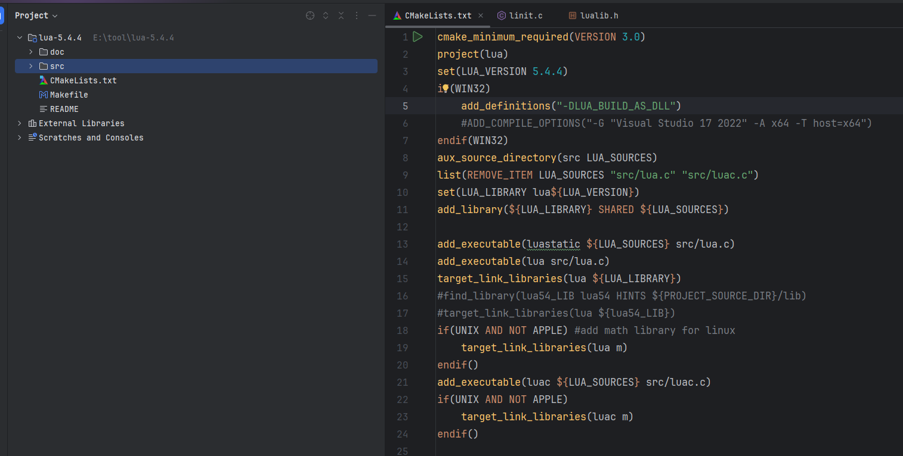
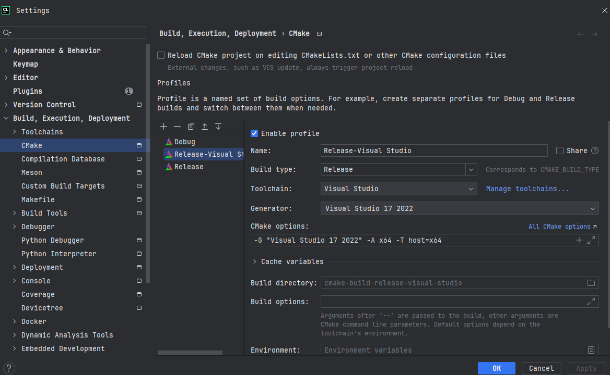

# lua源码编译

## 下载
lua5.4文档 https://www.lua.org/manual/5.4/

## 导入ide，本文以clion为例



## 改写makefile为cmake

源码使用的是makefile，现在改写为cmake工程

```camke
cmake_minimum_required(VERSION 3.0)
project(lua)
set(LUA_VERSION 5.4.4)
if(WIN32)
    add_definitions("-DLUA_BUILD_AS_DLL")
    # 这个是为了使用msvc时候设置编译选项的，整体含义就是使用msvc17 编译64位，默认32位，java无法使用
    #ADD_COMPILE_OPTIONS("-G "Visual Studio 17 2022" -A x64 -T host=x64")
endif(WIN32)
aux_source_directory(src LUA_SOURCES)
list(REMOVE_ITEM LUA_SOURCES "src/lua.c" "src/luac.c")
set(LUA_LIBRARY lua${LUA_VERSION})
add_library(${LUA_LIBRARY} SHARED ${LUA_SOURCES})

# 新增一个luastatic使用静态编译
add_executable(luastatic ${LUA_SOURCES} src/lua.c)

# 使用动态库，依赖于dll或者so
add_executable(lua src/lua.c)
target_link_libraries(lua ${LUA_LIBRARY})
#find_library(lua54_LIB lua54 HINTS ${PROJECT_SOURCE_DIR}/lib)
#target_link_libraries(lua ${lua54_LIB})
if(UNIX AND NOT APPLE) #add math library for linux
    target_link_libraries(lua m)
endif()
add_executable(luac ${LUA_SOURCES} src/luac.c)
if(UNIX AND NOT APPLE)
    target_link_libraries(luac m)
endif()

```

## 编译


mingw和msvc都可以，msvc需要设置64位


## 附录
校验exe文件是64位还是32位
使用二进制打开exe文件，看看pe后面是d还是l d就是64位
